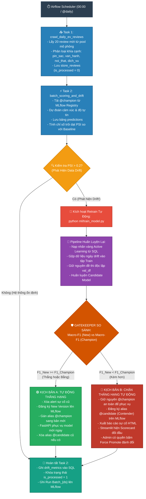
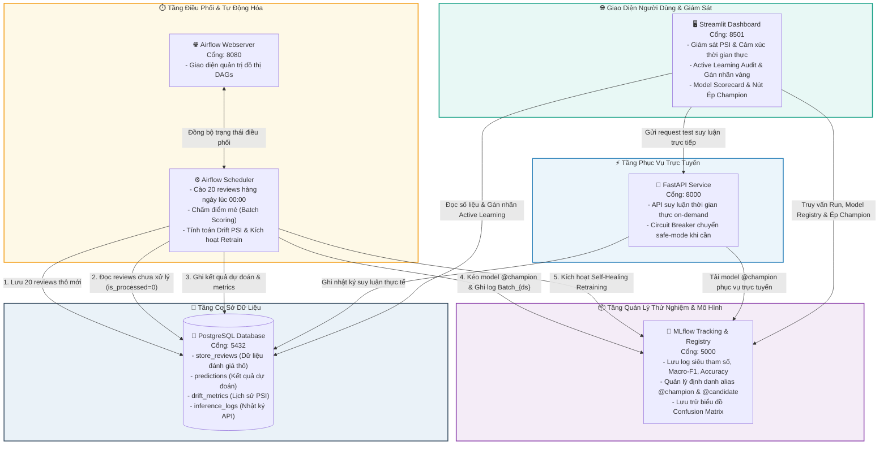

# 🚗 Hệ Thống MLOps Phân Tích Cảm Xúc Đánh Giá Xe Điện & Giám Sát Tự Phục Hồi
*(Vietnamese EV Review Sentiment Analysis & Self-Healing MLOps Pipeline)*

Hệ thống MLOps hoàn chỉnh, có khả năng tái lập và sẵn sàng triển khai thực tế (production-grade) nhằm phân loại cảm xúc đánh giá xe điện tiếng Việt, giám sát trôi dạt dữ liệu theo thời gian thực (PSI) và tự động kích hoạt vòng lặp huấn luyện lại tự phục hồi (Self-Healing Retraining) với chốt chặn an toàn Gatekeeper.

---

## 🔄 Quy Trình Vận Hành Toàn Diện (End-to-End MLOps Flow & Gatekeeper Logic)

Sơ đồ bên dưới minh họa quy trình vận hành khép kín từ lúc Airflow kích hoạt định kỳ lúc 00:00, cào dữ liệu mới, chấm điểm hàng loạt (batch scoring), kiểm tra trôi dạt dữ liệu (Data Drift PSI), tự động kích hoạt tái huấn luyện (Self-Healing), và cơ chế phân nhánh nghiêm ngặt tại chốt chặn **Gatekeeper**:



### 📋 Chi Tiết Từng Giai Đoạn Vận Hành

#### Giai Đoạn 1: Airflow Khởi Chạy DAG (`daily_sentiment_analysis`)
1. **00:00 Nửa đêm:** Airflow Scheduler tự động kích hoạt DAG với execution date `{{ ds }}` đại diện cho ngày vừa trôi qua.
2. **Task 1: `crawl_daily_ev_reviews` (Thu thập dữ liệu):**
   * Lấy **20 đánh giá xe điện mới** từ kho dữ liệu mô phỏng (`data/ev_feed_simulation_pool.csv`).
   * Phân loại danh mục khía cạnh (`pin_sac`, `van_hanh`, `noi_that`, `dich_vu`).
   * Ghi 20 dòng này vào bảng cơ sở dữ liệu `store_reviews` với cờ `is_processed = 0` (đánh dấu dữ liệu chưa chấm điểm).
   * *Bảo vệ Idempotency:* Nếu ngày này đã có dữ liệu trong SQL thì tự động bỏ qua, không ghi đè.
3. **Task 2: `batch_scoring_and_drift_monitoring` (Chấm điểm & Giám sát):**
   * Quét bảng `store_reviews` lấy các dòng có `is_processed = 0` của ngày hôm đó.
   * Tải mô hình đương kim vô địch **`@champion`** từ MLflow Model Registry (`models:/ev-sentiment-model@champion`).
   * Thực hiện suy luận: Dự đoán nhãn (Positive / Neutral / Negative) cùng xác suất tự tin `confidence` và lưu vào bảng `predictions`.
   * **Kiểm tra trôi dạt (Data Drift):** Tính chỉ số **PSI (Population Stability Index)** giữa phân phối sentiment của ngày hôm nay so với phân phối chuẩn ban đầu.
     * **Nếu PSI ≤ 0.2 (Không trôi dạt):** Mọi thứ ổn định ➔ Bỏ qua huấn luyện lại ➔ Nhảy thẳng tới bước chốt dữ liệu.
     * **Nếu PSI > 0.2 (Phát hiện Data Drift):** Tự động kích hoạt cơ chế **Self-Healing Retraining** (gọi lệnh chạy `python ml/train_model.py` với biến môi trường `DRIFT_DATE={{ ds }}`).

#### Giai Đoạn 2: Huấn Luyện Lại Tự Động (`ml/train_model.py`)
1. **Chia dữ liệu cố định:** Tải bộ 1,570 đánh giá xe điện chuẩn (`data/ev_reviews_vietnam_1529_cleaned.csv`), dùng hạt giống cố định (`random_state=42`) để tách:
   * Tập Train: 80% (1,256 dòng).
   * Tập Validation (`val_df`): 10% (157 dòng) – **đây là đề thi chuẩn độc lập của Gatekeeper**.
   * Tập Test: 10% (157 dòng).
2. **Nạp dữ liệu phản hồi (Active Learning & Drift Feedback Loop):**
   * Lấy toàn bộ các review đã được chuyên gia con người thẩm định (`verified_sentiment IS NOT NULL`) từ bảng `store_reviews`.
   * Lấy các review thuộc ngày bị drift, tự động gán nhãn dự phòng.
   * **Gộp toàn bộ dữ liệu mới này vào duy nhất tập Train** (tuyệt đối không làm thay đổi tập `val_df` để chống rò rỉ dữ liệu).
3. **Huấn luyện mô hình ứng viên (Candidate):** Học lại bộ từ vựng TF-IDF và thuật toán phân loại trên tập Train đã mở rộng.
4. **Kiểm tra Gatekeeper:**
   * Cho mô hình mới dự đoán trên tập `val_df` ➔ Ra điểm `Macro-F1 (New)`.
   * Tải mô hình `@champion` đang phục vụ về, cho dự đoán trên cùng tập `val_df` ➔ Ra điểm `Macro-F1 (Champion)`.

#### Giai Đoạn 3: Rẽ Nhánh Tại Gatekeeper (2 Kịch Bản Phân Nhánh)
* **🟢 KỊCH BẢN A: Mô hình mới TỐT HƠN hoặc BẰNG (`Macro-F1 New >= Macro-F1 Champion`):**
  * Xóa các cảnh báo lỗi cũ trong `data/alerts/retrain_failed_*.html`.
  * Ghi log tham số, Macro-F1, Accuracy, Confusion Matrix lên MLflow Run.
  * Kiểm tra lần cuối trên tập Test mù độc lập.
  * Đăng ký phiên bản mới lên MLflow Model Registry và **thăng hạng trực tiếp lên `@champion`**. Xóa tag contender cũ nếu có.
  * **Tác động:** FastAPI (`:8000`) và đợt batch scoring tiếp theo lập tức phục vụ bằng mô hình mới; Streamlit (`:8501`) cập nhật phiên bản champion ngay lập tức.
* **🔴 KỊCH BẢN B: Mô hình mới KÉM HƠN (`Macro-F1 New < Macro-F1 Champion`):**
  * **Chặn tự động thăng hạng:** Không cho đè lên `@champion`. Giữ nguyên Champion cũ đang chạy ổn định để đảm bảo **Zero Downtime & Zero Regression**.
  * **Đăng ký làm Contender (`@candidate`):** Mô hình mới vẫn được lưu trữ và gắn tag `@candidate` trên MLflow Model Registry để theo dõi và so sánh.
  * **Xuất báo cáo sự cố:** Tạo file HTML tại `data/alerts/retrain_failed_YYYY_MM_DD_HHMM.html` so sánh trực quan Macro-F1 của 2 mô hình.
  * **Bảng so sánh & Quyền can thiệp thủ công (Admin Break-Glass Override trên Streamlit):**
    * Trên thanh Sidebar của Streamlit xuất hiện bảng **Scorecard đối đầu trực tiếp**: So sánh Macro-F1, Accuracy và số lượng mẫu huấn luyện (`train_dataset_size`).
    * **Nút bấm:** `⚠️ Chấp nhận đánh đổi: Ép lên Champion 🏆`.
    * **Ý nghĩa nghiệp vụ:** Giúp Admin có thể chủ động chấp nhận đánh đổi (ví dụ: F1 giảm nhẹ 1-2% trên tập val cũ nhưng mô hình đã kịp học thêm 50+ từ vựng xe điện mới phát sinh ngoài thực tế) mà không cần tốn chi phí và thời gian escalate cho Data Scientist can thiệp code.
  * **Con người can thiệp (Active Learning):** Chuyên gia có thể mở tab Active Learning Audit trên Streamlit để thẩm định và đính chính thêm các nhãn sai, sau đó bấm `Trigger Retrain Manual` khi đã có dữ liệu vàng chuẩn.

#### Giai Đoạn 4: Hoàn Tất Task 2 và Đóng Mẻ Chạy
1. Task 2 ghi nhận kết quả PSI và trạng thái drift vào bảng SQL `drift_metrics`.
2. **Khóa trạng thái (State-Locking):** Chạy `UPDATE store_reviews SET is_processed = 1` cho các đánh giá của ngày đó để chống tính toán trùng lặp.
3. Ghi log hoàn tất mẻ chạy `Batch_{ds}` lên MLflow và Airflow kết thúc với màu xanh lá (**Success**).

---

## 🏗️ Kiến Trúc Hệ Thống (System Architecture)

Hệ thống bao gồm **6 dịch vụ đồng bộ** được điều phối hoàn chỉnh thông qua Docker Compose:



### 📋 Bảng Chi Tiết 6 Dịch Vụ Thành Phần

| Dịch Vụ | Cổng (Port) | Công Nghệ Cốt Lõi | Nhiệm Vụ & Trách Nhiệm Trong Hệ Thống |
| :--- | :---: | :--- | :--- |
| **Streamlit Dashboard** | `8501` | Streamlit, Plotly, Pandas | Giám sát trực quan phân phối cảm xúc, biểu đồ PSI trôi dạt, không gian Active Learning Audit thẩm định nhãn, và bảng Scorecard đối đầu Champion vs Contender. |
| **FastAPI Serving** | `8000` | FastAPI, Pydantic, Uvicorn | Cung cấp RESTful API phân loại cảm xúc thời gian thực (độ trễ < 5ms trên CPU), tích hợp Circuit Breaker an toàn chuyển sang safe-mode khi có biến cố. |
| **Airflow Scheduler** | Chạy ngầm | Apache Airflow 2.8, Python | Tự động kích hoạt lúc 00:00: cào 20 review, tiền xử lý, suy luận hàng loạt, tính toán PSI drift, và tự động gọi Self-Healing Retrain khi trôi dạt dữ liệu. |
| **Airflow Webserver** | `8080` | Apache Airflow UI, Flask | Cung cấp giao diện quản lý đồ thị DAG, kích hoạt thủ công (`Trigger DAG`), kiểm tra nhật ký chi tiết của từng Task. |
| **MLflow Registry** | `5000` | MLflow, SQLAlchemy, SQLite | Trung tâm theo dõi thử nghiệm (Experiment Tracking), ghi log metrics/hyperparameters, và quản trị vòng đời mô hình với các alias `@champion` và `@candidate`. |
| **PostgreSQL Database** | `5432` | PostgreSQL 15 | Cơ sở dữ liệu quan hệ lưu trữ tập trung: đánh giá xe điện (`store_reviews`), dự đoán (`predictions`), chỉ số trôi dạt (`drift_metrics`) và log API (`inference_logs`). |

---

## 🚀 Chế Độ Khởi Động & Vận Hành Hệ Thống

Dự án hỗ trợ **hai chế độ vận hành độc lập**, phục vụ linh hoạt cho cả nhu cầu phát triển cá nhân và đánh giá triển khai sản phẩm:

---

### ⚡ Chế Độ A: Chạy Python Cục Bộ (Dành cho Lập Trình Viên & Kiểm Thử Nhanh)
*Sử dụng chế độ này để chạy trực tiếp trên máy cá nhân mà không cần khởi động hệ thống container Docker nền.*

*   **Cách khởi động (1 lệnh duy nhất):** Mở cửa sổ dòng lệnh tại thư mục gốc dự án và chạy:
    ```bash
    python run_local.py
    ```
    *Kịch bản này tự động chạy kiểm thử đơn vị Pytest, sau đó khởi chạy đồng thời cả máy chủ FastAPI (`:8000`) và bảng điều khiển Streamlit (`:8501`).*
*   **Địa chỉ truy cập trên trình duyệt:**
    *   **Bảng điều khiển Streamlit:** [http://localhost:8501](http://localhost:8501)
    *   **Tài liệu API Swagger FastAPI:** [http://localhost:8000/docs](http://localhost:8000/docs)
*   **Cách dừng hoạt động:** Nhấn tổ hợp phím **`[Ctrl + C]`** trong cửa sổ dòng lệnh đó. Toàn bộ tiến trình sẽ dừng và giải phóng cổng ngay lập tức.

---

### 🐳 Chế Độ B: Chạy Toàn Bộ Container Docker (Dành cho Trình Diễn, Chấm Điểm & Cloud)
*Sử dụng chế độ này để vận hành mạng lưới đầy đủ 6 dịch vụ hoàn chỉnh kết nối cơ sở dữ liệu PostgreSQL, Airflow và MLflow.*

#### 🚀 **Lệnh Khởi Tạo Sạch 1 Bước (1-Command Clean Slate Deployment)**
Để triển khai hoặc cài đặt mới lại toàn bộ hệ thống từ đầu trên bất kỳ máy chủ nào (máy tính cá nhân, GCP VM hoặc AWS EC2), chỉ cần chạy lệnh chuỗi sau:
```bash
docker compose down -v && \
docker compose build fastapi && \
docker compose run --rm fastapi python ml/train_model.py && \
docker compose run --rm fastapi python data/ingest_pipeline.py --backfill --reset && \
docker compose up -d --build && \
docker compose exec airflow-webserver airflow dags unpause daily_sentiment_analysis
```
*Lệnh trên tự động thực hiện trong vòng chưa đầy 60 giây:*
1. Dọn dẹp sạch sẽ các container và ổ đĩa dữ liệu cũ (`down -v`).
2. Xây dựng Docker images và huấn luyện mô hình ban đầu, đăng ký lên MLflow làm `@champion`.
3. Khởi tạo cơ sở dữ liệu PostgreSQL và nạp sẵn 25 ngày dữ liệu lịch sử ổn định (500 đánh giá xe điện không trùng lặp).
4. Khởi chạy toàn bộ 6 container ở chế độ nền: Postgres (`5432`), MLflow (`5000`), Airflow (`8080`), FastAPI (`8000`), Streamlit (`8501`).
5. Kích hoạt mở khóa DAG `daily_sentiment_analysis` trên Airflow để sẵn sàng chạy tự động hàng ngày.

#### 🌐 **Các Địa Chỉ Dịch Vụ Mở Trên Trình Duyệt**
*   **Bảng Điều Khiển Phân Tích Streamlit:** [http://localhost:8501](http://localhost:8501) *(Kết nối trực tiếp PostgreSQL, thẩm định Active Learning & số liệu vận hành)*
*   **Giao Diện Điều Phối Airflow:** [http://localhost:8080](http://localhost:8080) *(Tài khoản: `mlops` | Mật khẩu: `mlops`)*
*   **Trung Tâm Thử Nghiệm MLflow:** [http://localhost:5000](http://localhost:5000) *(Theo dõi experiment `ev-sentiment-analysis` & model `ev-sentiment-model`)*
*   **API Phục Vụ Dự Đoán FastAPI:** [http://localhost:8000/docs](http://localhost:8000/docs) *(Swagger UI kiểm thử API trực tuyến)*

#### ⚙️ **Sổ Tay Thao Tác Vận Hành Chuẩn (Operations Playbook)**
*   **Cập nhật mã nguồn (Không mất dữ liệu):** Khi kéo code mới về, chỉ cần build lại container bị ảnh hưởng mà vẫn giữ nguyên lịch sử PostgreSQL:
    ```bash
    git pull && docker compose up -d --build
    ```
*   **Tạm dừng toàn bộ hệ thống (Bảo lưu dữ liệu):** Tạm dừng an toàn các container nhưng giữ nguyên toàn bộ dữ liệu database:
    ```bash
    docker compose down
    ```
*   **Khởi động lại hệ thống (Bảo lưu dữ liệu):** Bật lại hệ thống với toàn bộ lịch sử dữ liệu nguyên vẹn:
    ```bash
    docker compose up -d
    ```
*   **Xóa toàn bộ làm lại từ đầu:** Chỉ cần chạy lại **Lệnh Khởi Tạo Sạch 1 Bước** ở trên.

---

## 🔄 Chi Tiết 3 Luồng Vận Hành Hệ Thống (MLOps Operational Flows)

### 1️⃣ **Luồng Chạy Tự Động Cuối Ngày (Scheduled Midnight Run - `@daily`)**
*   **Thời điểm kích hoạt:** Airflow Scheduler tự động kích hoạt DAG `daily_sentiment_analysis` vào 00:00 mỗi ngày với execution date `{{ ds }}` đại diện cho ngày vừa hoàn tất.
*   **Task 1: `crawl_daily_ev_reviews` (Thu thập dữ liệu mô phỏng):**
    *   Bot crawler trích xuất 20 đánh giá EV mới (chưa từng thu thập) từ kho dữ liệu mô phỏng `data/ev_feed_simulation_pool.csv`.
    *   Chỉ trích xuất raw text (không dùng nhãn sentiment có sẵn để đảm bảo tính khách quan thực tế), tự động phân loại danh mục khía cạnh xe điện (`pin_sac`, `van_hanh`, `noi_that`, `dich_vu`), gán `review_date = {{ ds }}`, `is_processed = 0`, `verified_sentiment = NULL`.
    *   Ghi dữ liệu vào bảng `store_reviews` với cơ chế **Idempotency** (nếu ngày `{{ ds }}` đã có dữ liệu crawl thì tự động bỏ qua, chống trùng lặp).
*   **Task 2: `batch_scoring_and_drift_monitoring` (Dự đoán hàng loạt & Giám sát trôi dạt):**
    *   Truy vấn các review đang chờ xử lý (`is_processed = 0`) thuộc ngày `{{ ds }}` từ `store_reviews`.
    *   Tiền xử lý văn bản qua hàm chuẩn hóa `clean_text`.
    *   Tải trực tiếp mô hình `@champion` đang phục vụ từ MLflow Model Registry (`models:/ev-sentiment-model@champion`).
    *   Thực hiện suy luận phân loại cảm xúc (Positive / Neutral / Negative) và tính toán độ tự tin `confidence` (từ `predict_proba`), sau đó lưu vào bảng `predictions`.
    *   Tính toán chỉ số trôi dạt dữ liệu **Population Stability Index (PSI)** so với phân phối sentiment chuẩn ban đầu.
    *   **Khi phát hiện Data Drift (`psi_score > 0.2`):**
        *   Tạo báo cáo cảnh báo HTML tại `data/alerts/drift_alert_<date>.html`.
        *   Gửi email cảnh báo thời gian thực qua Gmail SMTP (nếu cấu hình `SMTP_PASSWORD`).
        *   **Cơ chế Tự phục hồi (Self-Healing Retraining):** Tự động gọi pipeline `ml/train_model.py`: gộp dữ liệu huấn luyện gốc với các nhãn do con người thẩm định (`verified_sentiment IS NOT NULL`), đào tạo lại các mô hình ứng viên, kiểm định qua **Gatekeeper** đối đầu với champion hiện tại. Nếu mô hình mới vượt trội về Macro-F1, hệ thống lập tức thăng hạng lên `@champion` mới trong MLflow; nếu không đạt, hủy đăng ký và xuất báo cáo sự cố `data/alerts/retrain_failed_*.html`.
    *   Ghi nhận số liệu PSI, độ tự tin trung bình, tổng số mẫu vào bảng `drift_metrics`.
    *   **Khóa trạng thái (State-Locking):** Cập nhật `is_processed = 1` cho các đánh giá vừa xử lý để không bao giờ bị tính trùng.
    *   Ghi log thông số mẻ chạy (`batch_psi_score`, `batch_avg_confidence`, `batch_row_count`) lên MLflow run `Batch_{ds}`.

---

### 2️⃣ **Luồng Kích Hoạt DAG Thủ Công (Manual DAG Trigger)**
*   **Thời điểm kích hoạt:** Khi kỹ sư MLOps bấm nút **"Trigger DAG"** trên giao diện Airflow Web UI (`http://localhost:8080`) hoặc chạy lệnh CLI `airflow dags trigger daily_sentiment_analysis`.
*   **Cơ chế thực thi:**
    *   Airflow lập tức khởi tạo một DagRun mới với `logical_date` là ngày hiện tại.
    *   **Task 1 (`crawl_daily_ev_reviews`):** Kiểm tra xem ngày hiện tại đã có đợt crawl nào chưa:
        *   Nếu chưa có: Bốc 20 review mới từ pool nạp vào `store_reviews` với `is_processed = 0`.
        *   Nếu ngày hôm nay đã từng crawl: Cơ chế Idempotency kích hoạt, ghi log thông báo và bỏ qua bước insert để bảo vệ cơ sở dữ liệu.
    *   **Task 2 (`batch_scoring_and_drift_monitoring`):**
        *   Tìm tất cả các bản ghi `is_processed = 0` tương ứng ngày chạy và thực hiện toàn bộ quy trình: Preprocess ➔ Suy luận với model Champion ➔ Lưu bảng `predictions` ➔ Tính PSI Drift ➔ Kích hoạt Self-Healing nếu có drift ➔ Lưu bảng `drift_metrics` ➔ Cập nhật `is_processed = 1` ➔ Log MLflow.
        *   *(Lưu ý: Nếu kích hoạt script CLI trực tiếp `python airflow_home/dags/batch_scoring.py` mà không truyền `--date`, pipeline sẽ tự động quét TẤT CẢ các ngày đang tồn đọng `is_processed = 0` trong database và xử lý dứt điểm lần lượt từng ngày).*

---

### 3️⃣ **Luồng Kích Hoạt Huấn Luyện Lại Thủ Công (Manual Retraining Trigger)**
*   **Thời điểm kích hoạt:** Người vận hành bấm nút **"⚡ Trigger Retrain Manual"** trên sidebar giao diện Streamlit hoặc chạy lệnh `python ml/train_model.py` trong terminal/container.
*   **Cơ chế thực thi:**
    1.  **Thu nhận dữ liệu Active Learning:** Quét bảng `store_reviews` tìm các bản ghi đã được chuyên gia con người thẩm định hoặc sửa nhãn (`verified_sentiment IS NOT NULL` từ công cụ Active Learning Audit trên Streamlit).
    2.  **Mở rộng tập huấn luyện (Data Augmentation):** Gộp toàn bộ nhãn người thẩm định này vào tập huấn luyện gốc `data/train_v1.csv` làm nhãn vàng (gold labels), giúp mô hình cập nhật từ vựng mới của thị trường EV.
    3.  **Huấn luyện đa mô hình:** Khởi tạo TF-IDF vectorizer và huấn luyện 4 thuật toán phân loại (Logistic Regression, Linear SVM, Multinomial Naive Bayes, Complement Naive Bayes / Random Forest) trên tập dữ liệu đã mở rộng.
    4.  **Đánh giá trên tập Validation chuẩn:** Đánh giá Macro-F1 và Accuracy trên tập kiểm định độc lập `data/val_v1.csv`.
    5.  **Cơ chế Gatekeeper Validation (Chốt chặn an toàn):**
        *   So sánh Macro-F1 của mô hình ứng viên tốt nhất với mô hình `@champion` đang phục vụ thực tế.
        *   **Đạt chuẩn (Pass):** Nếu `Macro-F1 (New) >= Macro-F1 (Champion)`, mô hình mới được đăng ký phiên bản tiếp theo vào MLflow Model Registry và tự động thăng hạng lên `@champion`. Model mới lập tức có hiệu lực phục vụ cho cả FastAPI và Batch scoring.
        *   **Không đạt (Fail):** Nếu mô hình mới có hiệu năng thấp hơn Champion cũ, Gatekeeper từ chối tự động thăng hạng để bảo đảm độ ổn định hệ thống. Thay vào đó, mô hình mới được đăng ký với alias `@candidate` (Contender) và ghi nhận báo cáo sự cố `data/alerts/retrain_failed_YYYY_MM_DD_HHMM.html`. Trên giao diện Streamlit xuất hiện bảng Scorecard đối đầu trực tiếp kèm nút **`⚠️ Chấp nhận đánh đổi: Ép lên Champion 🏆`** cho phép Admin chủ động đưa Contender lên thay thế Champion nếu thấy hợp lý về mặt nghiệp vụ (Break-Glass Override).
    6.  **Ghi chép MLflow Tracking:** Toàn bộ siêu tham số, chỉ số đánh giá, kích thước tập dữ liệu (`train_dataset_size`), và biểu đồ Confusion Matrix được lưu trữ đầy đủ trên MLflow.

---

## 📊 Giám Sát, Tự Phục Hồi & Nhật Ký Vận Hành (Monitoring & Logs)

Để dễ dàng giám sát quá trình chấm điểm mẻ liên tục, cảnh báo trôi dạt dữ liệu và vòng lặp tự phục hồi retraining, hệ thống tổng hợp nhật ký minh bạch qua **4 nguồn chính**:

### **1. Nhật Ký Tự Phục Hồi Tự Động (Airflow Orchestration)**
Khi DAG chấm điểm mẻ hàng ngày phát hiện trôi dạt dữ liệu và tự động kích hoạt vòng lặp huấn luyện lại, toàn bộ log chuẩn (stdout/stderr) đều được Airflow ghi lại chi tiết.
*   **Vị trí kiểm tra:** Trên **Giao diện Airflow Web UI** (`http://localhost:8080`).
*   **Cách xem:** Đăng nhập bằng `mlops / mlops` ➔ Chọn DAG **`daily_sentiment_analysis`** ➔ Nhấp vào task chấm điểm mẻ đã hoàn tất gần nhất (màu xanh lá) ➔ Chọn tab **`Log`** ở trên cùng. Tại đây, bạn sẽ thấy toàn bộ nhật ký terminal của quá trình huấn luyện lại: từ nạp dữ liệu SQL, cập nhật trọng số TF-IDF, đánh giá Gatekeeper, cho đến lệnh đăng ký phiên bản lên MLflow.
*   **Kiến trúc 2 Task của DAG:**
    1. **`crawl_daily_ev_reviews`**: Mô phỏng cào dữ liệu xe điện định kỳ. Lấy ngẫu nhiên 20 đánh giá mới không trùng lặp từ pool dữ liệu (`data/ev_feed_simulation_pool.csv`), gắn ngày thực thi hiện tại (`{{ ds }}`), tự động phân loại khía cạnh (`pin_sac`, `van_hanh`, `noi_that`, `dich_vu`), và lưu vào `store_reviews` với cơ chế chống trùng lặp (idempotency).
    2. **`batch_scoring_and_drift_monitoring`**: Truy vấn các review chưa xử lý (`is_processed = 0`), dự đoán cảm xúc bằng mô hình `@champion` đang hoạt động, tính toán chỉ số trôi dạt PSI, và kích hoạt huấn luyện tự phục hồi nếu vượt ngưỡng 0.2.

### **2. Nhật Ký Huấn Luyện Lại Thủ Công (Streamlit Container)**
Khi quản trị viên kích hoạt huấn luyện lại thủ công bằng cách bấm nút **`Trigger Retrain Manual`** trên sidebar của Streamlit, kịch bản sẽ chạy bên trong container Streamlit.
*   **Vị trí kiểm tra:** Luồng stdout của dịch vụ Streamlit.
*   **Cách xem:** Mở terminal máy chủ hoặc máy cá nhân và chạy lệnh:
    ```bash
    docker compose logs -f streamlit
    ```
    Lệnh này sẽ hiển thị thời gian thực toàn bộ quá trình chạy của `ml/train_model.py`: tính toán chỉ số validation, gộp nhãn mới từ Active Learning, và đối đầu trực tiếp với champion hiện tại.

### **3. Nhật Ký So Sánh Mô Hình & Metadata (MLflow Registry)**
Mọi lần huấn luyện thành công và vượt qua chốt chặn an toàn Gatekeeper đều được đánh số phiên bản và lưu trữ đầy đủ.
*   **Vị trí kiểm tra:** **Giao diện MLflow Web UI** (`http://localhost:5000`).
*   **Cách xem:** Chọn Run đang hoạt động ➔ Kiểm tra các siêu tham số chính, điểm kiểm định (Macro-F1, Accuracy), thông số **`train_dataset_size`** (chứng minh nhãn mới từ Active Learning đã được nạp thành công!), và xem biểu đồ ma trận nhầm lẫn `Confusion Matrix` tương tác trong mục Artifacts.

### **4. Báo Cáo Sự Cố Huấn Luyện (Nhật Ký Gatekeeper Chặn Nâng Cấp)**
Nếu mô hình ứng viên mới không vượt qua được mô hình Champion hiện tại, chốt chặn an toàn Gatekeeper sẽ hủy quá trình nâng cấp tự động và xuất báo cáo sự cố định dạng HTML.
*   **Vị trí kiểm tra:** Trong thư mục **`data/alerts/`** trên ổ đĩa máy chủ.
*   **Cách xem:** Tìm các tệp có định dạng `retrain_failed_YYYY_MM_DD_HHMM.html`. Báo cáo này so sánh song song điểm số Macro-F1 của cả hai mô hình, giải thích rõ nguyên nhân vì sao bản cập nhật bị chặn lại nhằm bảo đảm an toàn cho tầng phục vụ trực tuyến (Zero Downtime & Zero Regression).

---

## 🛠️ Xử Lý Sự Cố Môi Trường Linux VM & Docker

Nếu triển khai trên máy chủ Cloud Linux mới (như **Google Cloud Platform VM / AWS EC2**) hoặc máy tính đời cũ, bạn có thể gặp xung đột phiên bản Docker ở mức hệ thống. Dưới đây là cách khắc phục nhanh:

### 🚨 1. Lỗi Lệnh: `docker compose` hoặc KeyError: `ContainerConfig`
Nếu chạy lệnh `docker compose` bị lỗi hoặc báo `KeyError: 'ContainerConfig'` khi khởi động, máy của bạn đang chạy phiên bản cũ Docker Compose V1 bằng Python (ví dụ: bản `1.29.2`).

Hãy nâng cấp lên phiên bản chính thức **Docker Compose V2** (viết bằng Go) bằng các lệnh sau:
```bash
# 1. Tạo thư mục plugins CLI
mkdir -p ~/.docker/cli-plugins/

# 2. Tải bản binary Docker Compose V2 chính thức từ GitHub
curl -SL https://github.com/docker/compose/releases/download/v2.24.1/docker-compose-linux-x86_64 -o ~/.docker/cli-plugins/docker-compose

# 3. Phân quyền thực thi
chmod +x ~/.docker/cli-plugins/docker-compose

# 4. Ghi đè liên kết tượng trưng /usr/local/bin cũ
sudo curl -SL https://github.com/docker/compose/releases/download/v2.24.1/docker-compose-linux-x86_64 -o /usr/local/bin/docker-compose
sudo chmod +x /usr/local/bin/docker-compose
```
Kiểm tra lại bằng lệnh `docker compose version` (kết quả hiển thị `v2.24.1+`).

### 🚨 2. Lỗi SQLite: `unable to open database file`
Ở các phiên bản trước, việc mount trực tiếp một tệp chưa tồn tại vào container (như `- ./mlflow.db:/app/mlflow.db`) có thể khiến Docker tạo nhầm `mlflow.db` thành một **thư mục**.

Để xử lý triệt để vấn đề này, **kiến trúc dự án đã quy hoạch toàn bộ việc lưu trữ SQLite (cả `results.db` và `mlflow.db`) vào thư mục chung `./data/`**, được mount ở cấp độ thư mục `- ./data:/app/data`. Cách này đảm bảo dữ liệu luôn được lưu bền vững 100%, không bị xung đột tệp-thư mục và chạy trơn tru ngay từ lần đầu!

Nếu gặp lỗi này trên VM cũ, bạn chỉ cần xóa thư mục rác do Docker tạo ra:
```bash
rm -rf mlflow.db
```

---

### ⚠️ CẢNH BÁO QUAN TRỌNG VỀ XUNG ĐỘT CỔNG (PORT CONFLICT)
**KHÔNG** chạy lệnh `python run_local.py` khi các container Docker đang hoạt động! Do Docker đã chiếm dụng các cổng `8000` (FastAPI) và `8501` (Streamlit), việc chạy đồng thời kịch bản local sẽ báo lỗi **`AddressAlreadyInUse` / `Port in use`**.

Luôn đảm bảo một chế độ đã dừng hoàn toàn trước khi khởi chạy chế độ còn lại!

---

## 🏆 Đánh Giá & Bảng Xếp Hạng Mô Hình (Benchmark Leaderboard)

Trong giai đoạn nghiên cứu và đánh giá thực nghiệm, chúng tôi đã thử nghiệm nhiều kiến trúc mô hình khác nhau trên tập dữ liệu phân tầng (Stratified Splits) và ghi lại toàn bộ tiến trình trên MLflow. Đối với tập dữ liệu đánh giá xe điện tiếng Việt (`data/ev_reviews_vietnam_1529_cleaned.csv`), mô hình **Logistic Regression (`C=2.0`, `solver='lbfgs'`)** được chọn làm `@champion` chính thức:

| Mô Hình Thử Nghiệm | Macro-F1 (Tập Validation) | Macro-F1 (5-Fold CV) | Accuracy (Validation) | Trạng Thái Đăng Ký |
| :--- | :---: | :---: | :---: | :---: |
| **Logistic Regression (`C=2.0`)** | **0.9203** | **0.8782 ± 0.0182** | **91.50%** | **🏆 Champion (Mô hình phục vụ chính thức @champion)** |
| **Linear SVM (`SGD log_loss`)** | 0.9265 | 0.8731 ± 0.0150 | 92.16% | Contender / Ứng viên thay thế |
| **Multinomial Naive Bayes** | 0.9203 | 0.8789 ± 0.0147 | 91.50% | Contender |
| **Complement Naive Bayes** | 0.9203 | 0.8789 ± 0.0147 | 91.50% | Contender |
| **Random Forest (150 cây)** | 0.9203 | 0.8752 ± 0.0123 | 91.50% | Baseline *(Dễ bị đánh lừa bởi câu tương phản)* |

*Mô hình Logistic Regression chiến thắng đã được kiểm tra độc lập một lần duy nhất trên tập Test mù (153 đánh giá chưa từng thấy), đạt **Accuracy: 88.24% và Macro-F1: 0.8830** (F1 Tiêu cực: 0.9114, F1 Trung tính: 0.8269, F1 Tích cực: 0.9106).*

> **Cập Nhật Phiên Bản Champion v2 (Tối Ưu Ngữ Nghĩa Xe Điện & Khử Thiên Lệch Trung Tính):**  
> Để khắc phục hiện tượng thiên lệch gán nhãn trung tính (Neutral Bias) do từ vựng xe điện phân bố không đồng đều, mô hình Champion v2 được nâng cấp với:  
> - Bổ sung mẫu câu chuyên ngành (thiết kế ngoại thất, màn hình dễ dùng, pin sạc nhanh, điều hòa làm mát, khoang hành lý) nâng quy mô lên **1,570 mẫu**.  
> - Tích hợp `class_weight='balanced'` và `sublinear_tf=True` với 8,000 n-gram đặc trưng nhằm cân bằng hàm phạt giữa 3 lớp cảm xúc.  
> - Kết quả kiểm định trên tập Test độc lập: **Accuracy đạt 89.17%**, **Macro-F1 đạt 0.8942**. Tỷ lệ tin cậy thấp (<60%) trên dữ liệu thử nghiệm thực tế giảm mạnh từ 92.3% xuống chỉ còn 46.2%, độ tin cậy trung bình tăng lên **59.3%**, nhận diện chính xác các phản ánh về điều hòa, trạm sạc và trải nghiệm lái.


---

### 🧠 Lý Do Lựa Chọn Mô Hình (Tại Sao Lại Là Logistic Regression?)

Chúng tôi chọn **Logistic Regression (`C=2.0, solver='lbfgs'`)** làm mô hình phục vụ trực tuyến `@champion` dựa trên 4 yếu tố vận hành thực tế cốt lõi:

1. **Khả Năng Xử Lý Xuất Sắc Các Câu Tương Phản & Ngữ Nghĩa Phức Tạp:** Khi thử nghiệm với các câu đánh giá xe điện mang tính tương phản cao (ví dụ: *"Nội thất nhìn thì hào nhoáng nhưng chất lượng gia công ọp ẹp, đi qua gờ kêu lạch cạch khó chịu"*), Logistic Regression cân bằng trọng số rất chuẩn xác giữa mệnh đề tiêu cực thực tế và từ ngữ tích cực gây nhiễu (`hào nhoáng`), trong khi các mô hình dạng cây quyết định (Tree Ensembles) thường bị nhầm lẫn.
2. **Phân Phối Xác Suất Chuẩn Xác (`predict_proba`):** Logistic Regression cung cấp xác suất dự đoán rất mịn và chuẩn mực, tạo điều kiện thuận lợi để tính độ tự tin theo thời gian thực và phân tầng độ bất định (Chia 3 bậc: Cao ≥80%, Trung bình 60-79%, Thấp <60%) phục vụ vòng lặp Active Learning.
3. **Khả Năng Giải Thích Minh Bạch (Explainable AI):** Các hệ số tuyến tính (coefficients) đại diện trực tiếp cho mức độ tác động tích cực hay tiêu cực của từng n-gram từ vựng, giúp kỹ sư và chuyên viên nghiệp vụ dễ dàng kiểm toán lý do tại sao một câu review lại được phân loại như vậy.
4. **Độ Trễ Siêu Thấp Trên CPU (Sub-millisecond Latency):** Thời gian huấn luyện lại chưa đầy 0.05 giây và độ trễ suy luận dưới 5ms trên CPU tiêu chuẩn 1 luồng, hoàn toàn không cần hạ tầng GPU đắt đỏ.

---

### 🔬 Phương Pháp Luận Thực Nghiệm & Kỹ Thuật Đánh Giá

Để đảm bảo tính khách quan khoa học và triệt tiêu hoàn toàn nguy cơ rò rỉ dữ liệu (data leakage), quy trình thử nghiệm áp dụng các chuẩn mực sau:

*   **Chia Tập Dữ Liệu Phân Tầng Độc Lập (Stratified Split 80/10/10):** Tập dữ liệu 1,570 đánh giá xe điện (`data/ev_reviews_vietnam_1529_cleaned.csv`) được chia phân tầng 80% Train (1,256), 10% Validation (157), 10% Test (157) nhằm bảo toàn tuyệt đối tỷ lệ cân bằng giữa 3 lớp Tích cực, Trung tính và Tiêu cực trên tất cả các tập.
*   **Chọn Macro-F1 Làm Thước Đo Quyết Định:** Dữ liệu cảm xúc thường xuyên biến động ngoài thực tế, do đó **Macro-F1** (trung bình cộng F1 của từng lớp nhãn) được sử dụng thay vì Accuracy đơn thuần. Điều này buộc mô hình phải hoạt động tốt đồng đều ở cả 3 nhóm cảm xúc thay vì thiên vị nhóm chiếm đa số.
*   **Kiểm Định Trên Tập Test Mù:** Mô hình Champion cuối cùng chỉ được chấm điểm đúng một lần duy nhất trên tập Test độc lập chưa từng tham gia quá trình tối ưu để bảo đảm khả năng tổng quát hóa thực tế.
*   **Phân Tích Ma Trận Nhầm Lẫn (Confusion Matrix):** Sử dụng `ConfusionMatrixDisplay` để nhận diện các điểm nghẽn giữa các lớp. Kết quả cho thấy Logistic Regression phân định ranh giới rất sạch sẽ, đặc biệt là ranh giới khó giữa lớp `Trung tính` và các lớp còn lại.
*   **Ghi Chép Minh Bạch Trên MLflow:** Toàn bộ siêu tham số, chỉ số đánh giá (Accuracy, Macro-Precision, Macro-Recall, Macro-F1), mã băm dữ liệu huấn luyện và biểu đồ ma trận nhầm lẫn đều được log tự động, bảo đảm tính tái lập 100%.

---

## 🛠️ Lập Trình & Kiểm Thử Cục Bộ Offline

Nếu muốn phát triển và kiểm thử toàn bộ ứng dụng trên máy cá nhân mà không cần dùng container Docker, bạn có thể dùng **kịch bản điều phối 1 bước** (`run_local.py`):

### **Cách Khởi Chạy (1 Thao Tác):**
```bash
python run_local.py
```
*Lệnh này sẽ tự động chạy toàn bộ bài kiểm thử đơn vị `pytest`, khởi động máy chủ phục vụ FastAPI và bật bảng điều khiển tương tác Streamlit cùng một lúc.*

### **Cách Dừng (1 Thao Tác):**
Chỉ cần nhấn **`[Ctrl + C]`** trong cửa sổ dòng lệnh. Toàn bộ tiến trình sẽ dừng lại an toàn, giải phóng cổng `8000` & `8501`, không để lại bất kỳ tiến trình rác nào chạy ngầm.

---

### **Các Lệnh Thành Phần Riêng Lẻ:**
Nếu cần chạy từng bước trong quy trình bằng tay, hãy đảm bảo bạn đang đứng tại thư mục gốc dự án:

1.  **Nạp & Tạo Dữ Liệu Lịch Sử (Backfill):** `python data/ingest_pipeline.py --backfill` *(Tạo và chấm điểm 25 ngày lịch sử ổn định để thiết lập baseline chuẩn và nạp sẵn dữ liệu cho dashboard)*.
2.  **Gửi Đánh Giá Xe Điện Mới (Storefront CLI):** `python data/submit_review.py` *(Giao diện dòng lệnh mô phỏng khách hàng gửi đánh giá mới chờ xử lý)*.
3.  **Huấn Luyện & Tuyển Chọn Champion:** `python ml/train_model.py` *(Quy trình huấn luyện tự động, ghi log lên MLflow và thăng hạng @champion qua Gatekeeper)*.
4.  **Chạy API Phục Vụ Cục Bộ:** `python api/main.py` *(Khởi chạy FastAPI trên cổng `:8000`)*.
5.  **Chạy Kiểm Thử Đơn Vị:** `python -m pytest ml/test_pipeline.py` *(Kiểm tra cấu trúc mã nguồn và kiểm định pipeline)*.

---

## 🌟 Tính Năng Hoàn Thiện Cấp Doanh Nghiệp (MLOps Maturity Level Up)

Không dừng lại ở việc phát hiện trôi dạt dữ liệu cơ bản như các đồ án học thuật thông thường, hệ thống được trang bị các tính năng chuyên sâu chuẩn doanh nghiệp:

*   **Vòng Lặp Phản Hồi Nhãn Vàng & Kiểm Toán Con Người (Active Learning & Human-in-the-Loop Audit):** Người vận hành có thể kiểm toán hàng loạt kết quả dự đoán của mô hình trực tiếp trên giao diện Streamlit bằng bảng tương tác (`st.data_editor`). Tính năng sở hữu **Cơ Chế Mở Khóa Thông Minh (Smart Unlocking)**: bảng thẩm định sẽ tự động mở khi phát hiện cảnh báo drift, khi Gatekeeper chặn thăng hạng mô hình mới, khi còn review thuộc mẻ trôi dạt lịch sử chưa được thẩm định, hoặc thông qua nút gạt quản trị **`🔓 Mở khóa thủ công`**. Cơ chế **Phê Duyệt Hàng Loạt 1 Chạm (1-Click Bulk Approval)** sao chép toàn bộ dự đoán thành nhãn vàng đã thẩm định. Vòng lặp tái huấn luyện (`train_model.py`) tự động quét bảng `store_reviews` tìm các nhãn người duyệt (`verified_sentiment IS NOT NULL`), gộp trực tiếp vào tập Train để mở rộng kho từ vựng thị trường cho mô hình!
*   **Cầu Dao An Toàn Phục Vụ (Serving Circuit Breaker):** Tích hợp công tắc chuyển mạch khẩn cấp trên sidebar của Streamlit, cho phép lập tức điều hướng lưu lượng FastAPI từ mô hình máy học sang bộ phân loại quy tắc từ khóa (safe-mode rule classifier) khi phát hiện sự cố bất thường trong vận hành, bảo đảm tính liên tục của nghiệp vụ (Zero Downtime).
*   **Phân Tích Chuyên Sâu Về Sức Khỏe Mô Hình & Độ Bất Định (Uncertainty Analytics):** Bảng điều khiển Streamlit hiển thị 4 biểu đồ MLOps chuyên sâu: (1) **Phân Bổ Cảm Xúc Theo Khía Cạnh Xe** (với bảng màu tương phản giao thông chuẩn: Đỏ `#e74c3c` cho Tiêu cực, Vàng `#f1c40f` cho Trung tính, và Xanh lá `#2ecc71` cho Tích cực), (2) **Độ Tự Tin Trung Bình Theo Từng Lớp Cảm Xúc**, (3) **Phân Tầng Độ Bất Định (Uncertainty Tier Bucketing)** chia làm 3 bậc (Cao ≥80%, Trung bình 60-79%, Thấp <60% để ưu tiên lọc các câu khó cần người thẩm định), và (4) **Chỉ Số Hiệu Chuẩn Tương Đồng Người - AI** (`Human-AI Agreement %`, `Số đánh giá đã duyệt`, `Số đánh giá bị người sửa`).
*   **Chuẩn Hóa Baseline & Chốt Chặn Retrain An Toàn:** Quy trình nạp 25 ngày dữ liệu lịch sử (`data/ingest_pipeline.py`) sử dụng tập baseline xe điện Việt Nam đã được hiệu chuẩn cân bằng ($PSI \approx 0.0051 \ll 0.15$), đi kèm cờ chốt an toàn `auto_retrain=False` để tránh kích hoạt retrain ngoài ý muốn trong lúc khởi tạo cơ sở dữ liệu. Bộ gán nhãn dự phòng (retraining fallback pseudo-labeler) tự động nhận diện chính xác các từ vựng chuyên ngành ô tô điện tiếng Việt (*"lỗi", "chậm", "sụt pin", "êm", "tiết kiệm"...*).

---

## 🚗 Bộ Dữ Liệu Đánh Giá Xe Điện Việt Nam (`data/ev_reviews_vietnam_1529_cleaned.csv`)

Để phục vụ bài toán phân loại cảm xúc chuyên ngành xe điện và làm cơ sở đo lường thực tế cho NLP tiếng Việt, dự án sử dụng bộ dữ liệu khách hàng đánh giá xe điện đã được làm sạch và thẩm định chuẩn:

*   **Đường dẫn tệp:** `data/ev_reviews_vietnam_1529_cleaned.csv`
*   **Quy mô tổng thể:** 1,570 dòng duy nhất với **100% nhãn thực tế đầy đủ**.
*   **Quy trình làm sạch & làm giàu dữ liệu:** Chuẩn hóa viết hoa đầu câu, sửa lỗi ngắt dấu câu giữa chừng (`. so với` ➔ `, so với`), loại bỏ dấu câu kép, bổ sung dấu câu kết thúc, bảo toàn chuẩn bảng mã Unicode tiếng Việt, đồng thời bổ sung các từ khóa chuyên sâu ngành xe điện (thiết kế ngoại thất, màn hình giải trí dễ dùng, pin sạc nhanh, điều hòa làm lạnh, khoang hành lý, trạm sạc) nhằm triệt tiêu điểm mù từ vựng và cân bằng trọng số giữa các lớp cảm xúc.
*   **Phân phối cảm xúc (Sentiment Distribution):**
    *   **Tích cực (Positive):** 608 đánh giá (38.73%)
    *   **Trung tính (Neutral):** 539 đánh giá (34.33%)
    *   **Tiêu cực (Negative):** 423 đánh giá (26.94%)
*   **Phân phối thương hiệu:** VinFast (447), BYD (301), Tesla (219), MG (170), Hyundai (156), Kia (151), Wuling (126).
*   **Phân phối nguồn thu thập:** YouTube (327), Đại lý xe (322), Diễn đàn ô tô (318), Facebook (302), Trang web đánh giá (301).

> **Lưu ý về thư mục `docs/`:** Thư mục `docs/` chứa tài liệu báo cáo (Slide thuyết trình `TMA Slide-Session 10.ppt`, bảng phân công `MLOPS-Projects.xlsx`, báo cáo benchmark `benchmark_ev_results.md`, và file raw backup 10,000 dòng) được cấu hình **hoàn toàn chỉ lưu trữ trên máy tính cá nhân (local)** và được thêm vào `.gitignore` để không bị đẩy lên Git.

---

## 🧠 Giới Hạn Phạm Vi & Đánh Đổi Thực Tế (MLOps Maturity Trade-offs)

Để phục vụ tốt nhất mục tiêu chạy thử nghiệm và chấm điểm linh hoạt trên máy đơn hoặc VM, một số thành phần quy mô hạ tầng lớn được chủ động giữ ở mức gọn nhẹ:

*   **Hạ Tầng Tự Động Co Giãn (Autoscaling Infrastructure):** Docker Compose phù hợp tối ưu cho máy tính cá nhân hoặc máy chủ ảo VM đơn lẻ. Khi chịu tải hàng triệu truy vấn/giây trong môi trường thương mại lớn, hệ thống sẽ cần nâng cấp lên Kubernetes (EKS/GKE) với Horizontal Pod Autoscaler (HPA).
*   **Quản Trị Khóa Bí Mật (Production Secrets Management):** Để tiện chấm điểm và chạy demo, các biến môi trường được cấu hình qua tệp cấu hình mẫu. Trong môi trường doanh nghiệp khép kín, các khóa bí mật cần được quản lý qua dịch vụ két khóa bảo mật chuyên dụng (như HashiCorp Vault hoặc AWS Secrets Manager).
